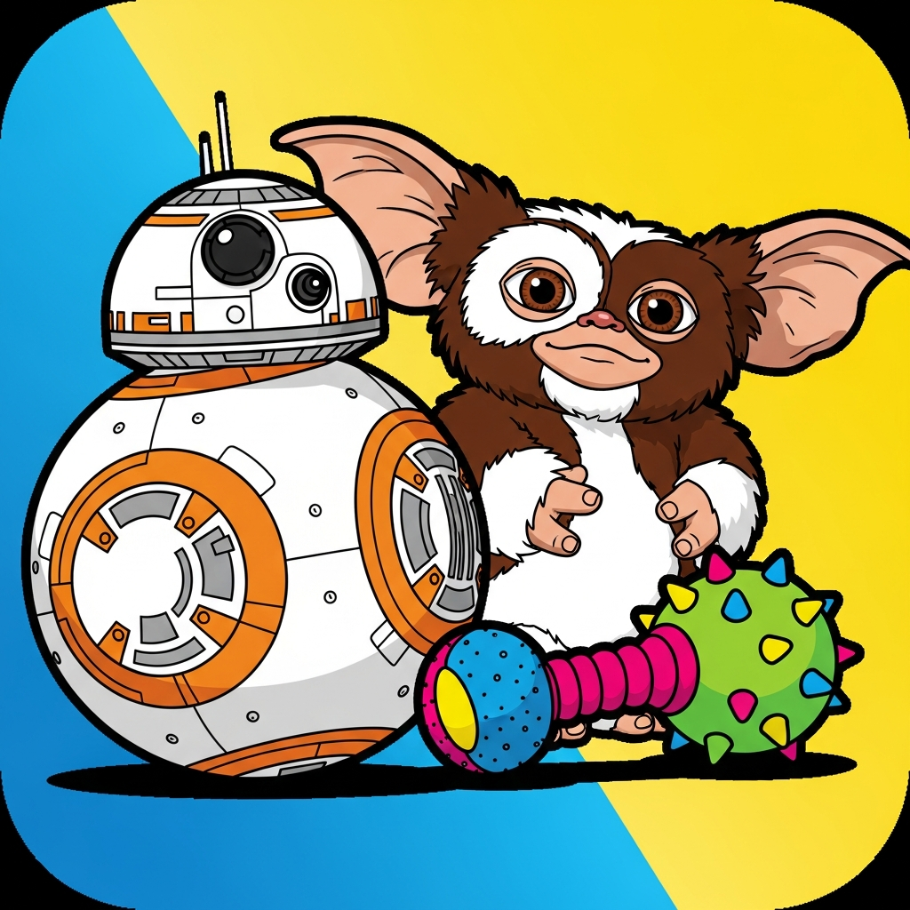

<h1>🤖 GizmoBall - El primer robot esférico con personalidad canina (y recubrimiento de peluche)</h1>

<div align="center">
  
</div>

[](https://opensource.org/licenses/MIT)
[](https://www.arduino.cc/)
[]()

**GizmoBall** es un robot interactivo diseñado para... bueno, para Gizmo. Un perro mestizo (Yorkshire + misterio) que ronca cuando programamos, se asusta de la "brujería electrónica" y supervisa cada proyecto desde el sofá. Este robot es esférico, está forrado de peluche y responde a la presencia y ladridos de Gizmo (o de cualquier otro perro curioso).

El objetivo: crear un compañero tecnológico que entienda de ladridos, respete las siestas y, de paso, sea barato de construir (~20€ en componentes de AliExpress).

---

## 📋 Tabla de Contenidos
- [Características](#-características)
- [Materiales Necesarios](#-materiales-necesarios)
- [Esquema de Conexiones](#-esquema-de-conexiones-pinout)
- [Lógica de Comportamiento](#-lógica-de-comportamiento)
- [Código Base](#-código-base-arduino)
- [Instalación y Configuración](#-instalación-y-configuración)
- [Consejos de Montaje "Anti-Gizmo"](#-consejos-de-montaje-anti-gizmo)
- [Mejoras Futuras](#-mejoras-futuras-con-ia)
- [Contribuciones](#-contribuciones)
- [Licencia](#-licencia)
- [Agradecimientos](#-agradecimientos)

---

## ✨ Características

- **Detección de proximidad** – Usa un sensor ultrasónico para saber si Gizmo está cerca.
- **Reacción a ladridos** – Micrófono que detecta sonidos fuertes (ideal para ladridos, ronquidos o "¿qué brujería es esa?").
- **Movimiento autónomo** – Dos motores con ruedas de goma para moverse hacia Gizmo... o huir si se asusta.
- **Expresividad sonora** – Reproduce sonidos personalizados (ladridos, ronquidos, pitidos de "brujería") mediante DFPlayer Mini.
- **Estado emocional con LED RGB** – Azul (curioso), amarillo (duda), rojo (susto), tenue (modo siesta).
- **Modo siesta** – Si no hay actividad, se relaja y ronca junto a Gizmo.
- **Carcasa esférica forrada de peluche** – Suave al tacto y resistente a mordiscos (con doble capa opcional).
- **Precio total ~13-18€** – Todos los componentes de AliExpress.

---

## 🛒 Materiales Necesarios

| Componente | Modelo / Tipo | Precio Aprox. (€) | Búsqueda en AliExpress |
|:---|:---|:---|:---|
| Microcontrolador | Arduino Nano (clon CH340) | 2-3€ | "Arduino Nano CH340" |
| Sensor de distancia | HC-SR04 | 1-1.5€ | "HC-SR04 ultrasonic sensor" |
| Micrófono | KY-038 o MAX4466 | 1-1.5€ | "KY-038 sound sensor" |
| Motores + ruedas | Mini motor DC con rueda de goma (x2) | 2-3€ | "DC motor with wheel" |
| Driver motores | L9110S | 0.8-1.5€ | "L9110S motor driver" |
| Módulo de audio | DFPlayer Mini + altavoz 3W | 2-2.5€ | "DFPlayer Mini speaker set" |
| LED RGB | Cátodo común 5mm | 0.5-1€ | "RGB LED common cathode" |
| Cables | Dupont hembra-hembra | 2-3€ (lote) | "Dupont cable female to female" |
| Carcasa | Bola plástica transparente 10-15cm | 1-2€ | "clear plastic ball ornament" |
| Recubrimiento | Tela de peluche o fieltro adhesivo | 1-2€ | "plush fabric sheet" |
| **TOTAL** | | **~13-18€** | |

> 💡 **Consejo**: Busca packs combinados como "Arduino Nano + HC-SR04 + KY-038 + L9110S" para ahorrar.

---

## 🔌 Esquema de Conexiones (Pinout)

| Componente | Pin Arduino | Función |
|:---|:---|:---|
| Sensor HC-SR04 (Trig) | D2 | Disparo ultrasonidos |
| Sensor HC-SR04 (Echo) | D3 | Recepción ultrasonidos |
| Micrófono KY-038 (Digital Out) | D4 | Detección de ladridos |
| Motor Izquierdo (A-IA) | D5 (PWM) | Movimiento izquierdo |
| Motor Izquierdo (A-IB) | D6 (PWM) | Movimiento izquierdo |
| Motor Derecho (B-IA) | D9 (PWM) | Movimiento derecho |
| Motor Derecho (B-IB) | D10 (PWM) | Movimiento derecho |
| DFPlayer Mini (TX) | D11 | Comunicación software serial |
| DFPlayer Mini (RX) | D12 | Comunicación software serial |
| LED RGB (Rojo) | D7 | Indicador emocional |
| LED RGB (Verde) | D8 | Indicador emocional |
| LED RGB (Azul) | D13 | Indicador emocional |
| **Alimentación** | 5V y GND | Para todos los componentes |

> 📌 **Nota**: El DFPlayer se conecta a D11 y D12 mediante `SoftwareSerial`. Si usas otros pines, ajusta el código.

---

## 🧠 Lógica de Comportamiento

El robot tiene cuatro modos principales, que se activan según las entradas de los sensores:

1. **Modo Exploración** (por defecto)
   - No hay obstáculos cercanos ni ladridos.
   - Se mueve hacia adelante lentamente.
   - LED azul fijo.

2. **Detección de Gizmo** (distancia < 30 cm)
   - Se detiene.
   - Reproduce sonido curioso (pista 2 en DFPlayer).
   - LED amarillo (rojo+verde).
   - Si Gizmo se acerca más (< 20 cm), entra en modo "evitar obstáculo" (retrocede y gira).

3. **Reacción al Ladrido** (micrófono activado)
   - Giro rápido de 360° (simula susto).
   - Reproduce sonido de sorpresa (pista 1).
   - LED rojo brillante.
   - Luego busca un refugio (se aleja en dirección aleatoria).

4. **Modo Siesta** (2 minutos sin actividad)
   - Se detiene por completo.
   - LED pulsante tenue (azul bajo).
   - Reproduce ronquidos grabados cada 10 segundos (pista 3).
   - Se reactiva al detectar cualquier movimiento o sonido.

---

## 💻 Código Base (Arduino)

Este es el firmware principal. Necesitarás instalar la librería **DFRobotDFPlayerMini** desde el Gestor de Librerías de Arduino.

```cpp
#include "Arduino.h"
#include "SoftwareSerial.h"
#include "DFRobotDFPlayerMini.h"

// Configuración de Pines
const int TRIG_PIN = 2;
const int ECHO_PIN = 3;
const int MIC_PIN = 4;
const int MOTOR_L_1 = 5;
const int MOTOR_L_2 = 6;
const int MOTOR_R_1 = 9;
const int MOTOR_R_2 = 10;
const int LED_R = 7;
const int LED_G = 8;
const int LED_B = 13;

SoftwareSerial mySoftwareSerial(12, 11); // RX, TX
DFRobotDFPlayerMini myDFPlayer;

unsigned long lastActivityTime = 0;
bool sleeping = false;

void setup() {
  // Modo de pines
  pinMode(TRIG_PIN, OUTPUT);
  pinMode(ECHO_PIN, INPUT);
  pinMode(MIC_PIN, INPUT);
  pinMode(MOTOR_L_1, OUTPUT);
  pinMode(MOTOR_L_2, OUTPUT);
  pinMode(MOTOR_R_1, OUTPUT);
  pinMode(MOTOR_R_2, OUTPUT);
  pinMode(LED_R, OUTPUT);
  pinMode(LED_G, OUTPUT);
  pinMode(LED_B, OUTPUT);

  Serial.begin(9600);
  mySoftwareSerial.begin(9600);

  if (!myDFPlayer.begin(mySoftwareSerial)) {
    Serial.println("Error al iniciar DFPlayer");
  }
  
  myDFPlayer.volume(25); // Volumen de 0 a 30
  lastActivityTime = millis();
}

void loop() {
  long distancia = medirDistancia();
  bool ladrido = digitalRead(MIC_PIN);
  unsigned long ahora = millis();

  // Detectar actividad
  if (distancia < 50 || ladrido) {
    lastActivityTime = ahora;
    if (sleeping) sleeping = false;
  }

  // Modo siesta si 2 minutos sin actividad
  if (!sleeping && (ahora - lastActivityTime > 120000)) {
    entrarModoSiesta();
  }

  if (sleeping) {
    // Comportamiento de siesta
    digitalWrite(LED_R, LOW);
    digitalWrite(LED_G, LOW);
    analogWrite(LED_B, 50); // Azul tenue
    if (ahora % 10000 < 100) { // Cada 10s
      myDFPlayer.play(3); // Ronquido
    }
    detener();
  } else {
    // Comportamiento normal
    if (ladrido) {
      reaccionarALadrido();
    } else if (distancia < 20) {
      evitarObstaculo();
    } else if (distancia < 30) {
      // Modo curioso
      setColor(255, 255, 0); // Amarillo
      myDFPlayer.play(2); // Sonido curioso
      detener();
    } else {
      setColor(0, 0, 255); // Azul
      moverAdelante(150);
    }
  }
  delay(100);
}

// ---------- FUNCIONES ----------
long medirDistancia() {
  digitalWrite(TRIG_PIN, LOW);
  delayMicroseconds(2);
  digitalWrite(TRIG_PIN, HIGH);
  delayMicroseconds(10);
  digitalWrite(TRIG_PIN, LOW);
  long duracion = pulseIn(ECHO_PIN, HIGH);
  return duracion / 58; // Distancia en cm
}

void setColor(int r, int g, int b) {
  analogWrite(LED_R, r);
  analogWrite(LED_G, g);
  analogWrite(LED_B, b);
}

void moverAdelante(int vel) {
  analogWrite(MOTOR_L_1, vel);
  analogWrite(MOTOR_L_2, 0);
  analogWrite(MOTOR_R_1, vel);
  analogWrite(MOTOR_R_2, 0);
}

void detener() {
  digitalWrite(MOTOR_L_1, LOW);
  digitalWrite(MOTOR_L_2, LOW);
  digitalWrite(MOTOR_R_1, LOW);
  digitalWrite(MOTOR_R_2, LOW);
}

void reaccionarALadrido() {
  setColor(255, 0, 0); // Rojo
  myDFPlayer.play(1); // Sonido de susto
  // Giro de 360°
  analogWrite(MOTOR_L_1, 200);
  analogWrite(MOTOR_L_2, 0);
  analogWrite(MOTOR_R_1, 0);
  analogWrite(MOTOR_R_2, 200);
  delay(1000);
  detener();
}

void evitarObstaculo() {
  setColor(255, 0, 0); // Rojo (peligro)
  detener();
  myDFPlayer.play(2); // Sonido de duda
  delay(500);
  // Marcha atrás
  analogWrite(MOTOR_L_1, 0);
  analogWrite(MOTOR_L_2, 150);
  analogWrite(MOTOR_R_1, 0);
  analogWrite(MOTOR_R_2, 150);
  delay(800);
  detener();
}

void entrarModoSiesta() {
  sleeping = true;
  detener();
  setColor(0, 0, 50); // Azul tenue
  myDFPlayer.play(3); // Ronquido inicial
}
```

---

## ⚙ Instalación y Configuración

### 1. Preparar los sonidos
En una tarjeta microSD (formato FAT16/FAT32), crea una carpeta `mp3` y copia los archivos:
- `0001.mp3` – Sonido de susto (ideal: grito electrónico o "¡Ouuuh!")
- `0002.mp3` – Sonido curioso (ej. "¿Mmm?" o pitido interrogante)
- `0003.mp3` – Ronquido (puedes grabar a tu perro roncando)

### 2. Cargar el código
- Abre Arduino IDE.
- Instala la librería **DFRobotDFPlayerMini** (buscar en Gestor de Librerías).
- Selecciona placa **Arduino Nano** y procesador **ATmega328P**.
- Conecta el Nano por USB y sube el código.

### 3. Probar componentes por separado
Antes de montar todo en la bola, prueba en protoboard:
- Motores: deben girar al enviar señales PWM.
- Sensor ultrasónico: abre el monitor serie y verifica distancias.
- Micrófono: habla fuerte y observa el pin D4 (debería ponerse HIGH).
- DFPlayer: reproduce las pistas al llamar a `myDFPlayer.play(X)`.

### 4. Integración en la bola
- Coloca los motores en la parte inferior de la bola, con las ruedas asomando.
- Sujeta el Arduino, driver y batería con espuma o bridas.
- El sensor y micrófono deben apuntar hacia fuera (haz agujeros).
- El altavoz también necesita un agujero (cúbrelo con tela para evitar suciedad).
- Finalmente, forra el exterior con peluche, dejando aberturas para ruedas y sensores.

---

## 🛠 Consejos de Montaje "Anti-Gizmo"

### Doble Carcasa
Si Gizmo es muy bruto (o muy curioso), mete la bola de plástico dentro de una segunda capa de espuma antes de poner el peluche. Esto absorberá impactos y mordiscos.

### Ventilación
Los motores y la batería pueden calentarse. Asegúrate de que el peluche no tape herméticamente todo; deja pequeñas rejillas de ventilación ocultas tras el pelo (puedes usar un punzón caliente para hacer microagujeros).

### Acceso a Carga
Incorpora una cremallera o velcro en el peluche para poder sacar el Power Bank y recargarlo sin tener que "desollar" al pobre GizmoBall.

### Protección de sensores
Pon una malla fina (de las de ventilación) sobre el micrófono y el altavoz para que Gizmo no meta el hocico directamente.

---

## 🚀 Mejoras Futuras (con IA)

Este es solo el MVP. Ya estamos trabajando en la versión 2.0 con:

- **Reconocimiento de ladridos** con TinyML (TensorFlow Lite para Arduino) para distinguir entre "quiero jugar", "hay un cartero" y "ronquido".
- **Visión por cámara** (ESP32-CAM) para que el robot reconozca a Gizmo y le siga la mirada.
- **Aprendizaje de rutinas** – Que el robot sepa cuándo Gizmo suele dormir y active el modo siesta automáticamente.
- **Dispensador de premios** – Un servo con compuerta para soltar croquetas cuando Gizmo interactúa correctamente.

¿Te animas a contribuir? ¡Todo el código es abierto!

---

## 🤝 Contribuciones

Las contribuciones son bienvenidas. Especialmente si tienes un perro que ladra a objetos electrónicos. Puedes:

- Reportar bugs (sobre todo si GizmoBall sale huyendo y se choca contra una pared).
- Sugerir mejoras en la lógica de comportamiento.
- Grabar sonidos de tu perro para el banco de voces oficial.
- Crear una funda de peluche con forma de tu mascota.

**Cómo contribuir**:
1. Haz un fork del repositorio.
2. Crea una rama (`git checkout -b feature/nueva-funcionalidad`).
3. Haz commit de tus cambios.
4. Sube la rama (`git push origin feature/nueva-funcionalidad`).
5. Abre un Pull Request.

---

## 📄 Licencia

Este proyecto está bajo la Licencia MIT. Puedes usarlo, modificarlo y venderlo, pero si tu perro se enamora del robot, no nos hacemos responsables.

---

## 🙏 Agradecimientos

- A **Gizmo**, el primer perro QA (Quality Assurance) del mundo, por su paciencia, sus ronquidos y su capacidad para detectar brujería electrónica.
- A su humano, por confiar en que un perro mestizo puede inspirar tecnología punta.
- A todos los perros que algún día tendrán su propio GizmoBall.

---

**¡Que empiece la revolución canino-tecnológica!** 🐕‍🦺🤖✨

---

> "Si tu perro ladra al robot, es que funciona."  
> — Gizmo, primer programador honorario en lenguaje BarkCode.
